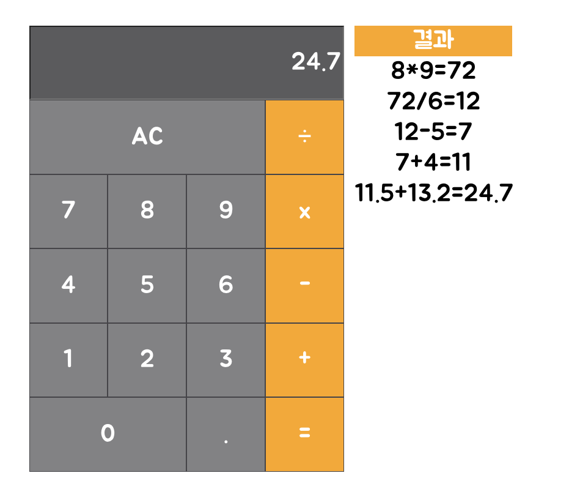

# React로 계산기 만들기

## 기능 및 작동 범위

### 구현한 기능

- eval() 함수로 계산
- 결과 기록

### 처리한 에러

- 마지막에 연산자로 끝나는 경우 (ex. '5+')
- 빈칸 상태에서 '='버튼 누르는 경우

### 처리해야되는 에러

- 연산자가 연속되는 경우 (ex. '5++', '17*/9')
- 연산자로 시작하는 경우 (ex. '*7', '/28')

## 만든 방법
### class로 만들기
    App.js에 한 번에 다 만들었다. class로 App을 만들어서 그 안에 state 선언하고 setState를 이용했다.

### useState로 만들기
    hooks를 배운 뒤 useState를 이용해서 만들었다. Calculator.js 파일을 따로 만들었고 class로 만들었던 것에서 크게 수정하지 않았다.